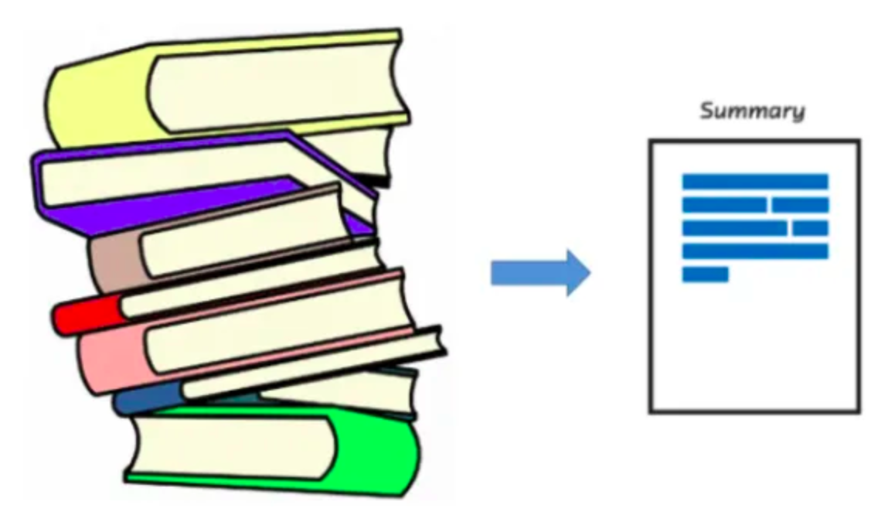

# End-to-End Text Summarizer with Huggingface Model

## Table of Contents
  * [Demo](#demo)
  * [Overview](#overview)
  * [Motivation](#motivation)
  * [What it does](#what-it-does)
  * [Getting Started](#Getting-started)
  * [Installation](##installation)
  * [Setup](##setup)
  * [Usage](#usage)
  * [Directory Tree](#directory-tree)
  * [To Do](#to-do)
  * [Bug / Feature Request](#bug---feature-request)
  * [Techstack Used](#techstack-used)
  * [License](#license)
  * [Credits](#credits)

## Demo
[Link:](Project_Demo_Showcase.mp4)

https://github.com/user-attachments/assets/21faa3b6-c36d-4248-ba2f-cfeecd943c70

## Overview
This is an end-to-end text summarization web application based on fastAPI. It uses a **finetuned version** of the [pegasus model](https://huggingface.co/google/pegasus-cnn_dailymail) to summarize the text from any source. This project involved building an **end-to-end pipeline** encompassing **data ingestion**, **data transformation**, **model training**, **evaluation**, and **prediction**, along with **API integration** and **web hosting** for seamless user interaction. Additional features include the implementation of **GitHub Actions** for continuous integration, robust **Python logging** for efficient debugging, and workflow optimization.

## Motivation
Imagine a scenario where you want a specific context from a news paper article. Wouldn't it be a tedious task to read the entire article? Instead if you know the context information for specific section of text, you can decide whether to go through that specific section or not. So you can take help of this summarizer to find out which part of the newspaper or any other source, you are interested in. This approach is quicker and reliable as it uses a **trained** and **finetuned sequence-to sequence model** which retrieves the accurate context from the query.

## What it does ?
Before going to the functioning of the project I will brief upon the initial setup
* **Create requirements.txt file to install all the dependencies.**
* **Create a series of directories and files to organize the project effectively. Configure logging to log all actions like directory and file creation or skipping existing files. Here we are allowing for modular logging.**
* Create a **pipeline** which **downloads** the data from hugging face and **extracts** it, **preprocess** and **transform** the data, **train** the model on the **prepared data** and **evaluate** the model's performance.
* The **stages** are **executed** in a **sequential manner**, ensuring that each step is completed before moving to the next.
* **Each stage logs its initiation and completion for traceability.** Errors are logged using logger.exception(), which captures both the error message and stack trace.
* **Each stage is wrapped in a try-except block to handle any exceptions gracefully.** If an exception occurs in any stage, it is logged, and the error is raised to stop further execution. This ensures that any issue is properly captured, and the pipeline does not continue in a failed state.
* Now, we have the model and tokenizer. We load these to run predictions on the unseen text. So, A prediction is created which uses this Huggingface summarizer pipeline, model, tokenizer to generate summary on a completely new text.
* **For all the above actions, we continuously integrate  with github by commiting and pushing it to the github repository.**

Now comes the part of **setting up a FastAPI web application** that exposes a simple endpoint for text summarization by integrating with the prediction pipeline. 
The **FastAPI application serves a REST API** with two routes:
* **Root Route (/):** Redirects users to the API documentation (/docs).
* **Prediction Route (/predict):** Accepts a POST request with text, processes it through the PredictionPipeline, and returns the summarized text.
* The server runs on http://0.0.0.0:8080 when executed.

## Getting Started
  We will get started with installation and set up process

